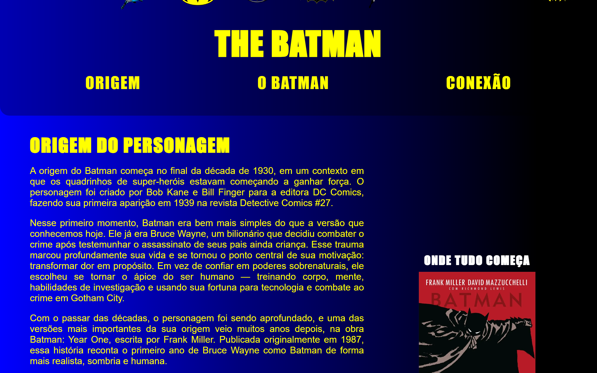

# Minha História e Batman

**Atividade avaliativa da faculdade** · HTML · CSS · JavaScript

[](LICENSE)

Site que relaciona aspectos da minha trajetória pessoal com a história do personagem Batman, explorando semelhanças, desafios e inspirações de forma criativa.



## Sobre o projeto

Projeto desenvolvido como atividade avaliativa da disciplina, seguindo os conteúdos e requisitos propostos pela professora durante o período, com foco na aplicação prática dos conhecimentos adquiridos em sala de aula.

## Stack

- **HTML5**
- **CSS3**
- **JavaScript**

## Como rodar

```bash
git clone https://github.com/joaobatis1a/batmain.git
cd batmain
```

Abra o arquivo `index.html` no navegador, ou use a extensão **Live Server** no VS Code.

## Autor

**João Batista da Silva Neto**

- GitHub: [@joaobatis1a](https://github.com/joaobatis1a)
- LinkedIn: [joao-batista-silva-neto](https://linkedin.com/in/joao-batista-silva-neto)
- E-mail: [profissionalba1is1a@gmail.com](mailto:profissionalba1is1a@gmail.com)

## Licença

Distribuído sob a licença MIT. Veja [`LICENSE`](LICENSE) para mais detalhes.
